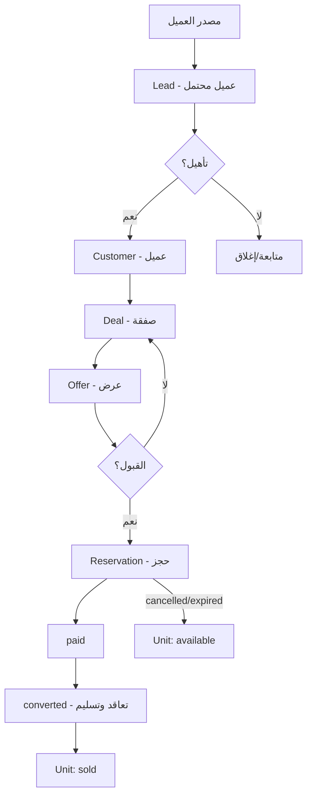

# 📋 Workflow — لوحة تحكم Venecia Developments

توثيق سير العمل (Workflows) داخل لوحة التحكم لنظام إدارة العقارات.

> آخر تحديث: 2026-08-14 · التطبيق: Laravel 12 (Venecia Developments)

---

## 1. نظرة عامة

لوحة التحكم هي قلب النظام الإداري، وتدير دورة حياة العقار من لحظة دخول **عميل محتمل (Lead)** حتى **التسليم**، مروراً بالصفقات والعروض والحجوزات.

**الرموز المستخدمة:**
- 🟢 خطوة رئيسية
- 🔁 عملية دورية
- ⛔ نقطة توقف / إنهاء

---

## 2. خريطة لوحة التحكم (الوحدات)

| الوحدة | المسار | الوظيفة |
|--------|--------|---------|
| **لوحة المعلومات** | `/dashboard` | مؤشرات الأداء والتحليلات |
| **CRM — السبورة** | `/crm` | لوحة كانبان لمراحل المبيعات |
| **CRM — البحث** | `/crm/search` | بحث موحّد (عملاء، شركات، جهات اتصال، صفقات) |
| **الصفقات** | `/crm/deals` | إدارة أنابيب المبيعات والصفقات |
| **العملاء** | `/crm/customers` | قاعدة العملاء |
| **الشركات** | `/crm/organizations` | الشركات/الوسطاء |
| **جهات الاتصال** | `/crm/contacts` | جهات الاتصال |
| **العروض** | `/crm/offers` | عروض البيع |
| **الحجوزات** | `/crm/reservations` | حجوزات الوحدات |
| **المشروعات** | `/dashboard/projects` | المشروعات/المباني/الأدوار/الوحدات |
| **خطط الدفع** | `/crm/plans` | خطط التقسيط |
| **التقارير** | `/dashboard/reports` | التقارير المالية والتشغيلية |
| **البنرات** | `/dashboard/banners` | محتوى الموقع العام |
| **المستخدمون** | `/dashboard/users` | المستخدمون والأدوار |
| **الإعدادات** | `/dashboard/settings` | ملف الشركة والميزات |
| **سلة المحذوفات** | `/dashboard/trash` | الاسترجاع والحذف النهائي |
| **الإشعارات** | — | تنبيهات النظام |

---

## 3. الأدوار والصلاحيات

| الدور | الصلاحيات الأساسية |
|-------|--------------------|
| **Administrator** | كل الصلاحيات |
| **Sales Manager** | إدارة كاملة للمبيعات + تعيين المندوبين |
| **Sales Executive** | إضافة وتعديل العملاء المحتملين والصفقات الخاصة به |
| **Marketing Manager** | إدارة المحتوى والبنرات والتقارير التسويقية |
| **Accountant** | العروض المالية والتقارير |
| **Receptionist** | تسجيل العملاء المحتملين الوافدين |
| **Viewer** | قراءة فقط |
| **Owner** | صلاحيات المالك (كل شيء) |

> تُدار الصلاحيات عبر نظام Spatie (8 أدوار / 46 صلاحية).

---

## 4. دورة حياة الوحدة (Unit Lifecycle)

```
مشروع Project → مبنى Building → دور Floor → وحدة Unit
```

| الحالة | المعنى |
|--------|--------|
| `available` | متاحة للبيع |
| `reserved` | محجوزة (عبر حجز نشط) |
| `sold` | مباعة |
| `hidden` | مخفية عن الموقع العام |

**سير العمل:**
1. إنشاء **مشروع** ثم **مبنى** ثم **أدوار** ثم **وحدات**
2. تحديد المواصفات (المساحة، الغرف، الأسعار، التشطيب)
3. رفع الصور وتحديد الإحداثيات على الخريطة
4. وضع الوحدة `available` لتظهر في الموقع العام
5. عند قبول عرض/حجز → تتحول إلى `reserved`
6. عند اكتمال التعاقد → `sold`
7. يمكن إخفاؤها يدوياً (`hidden`) للإدارة الداخلية

> ⚠️ تسعير الوحدة يؤثر على التقارير المالية وتوقعات الأقساط.

---

## 5. سير عمل المبيعات (Sales Pipeline)

أنبوب المبيعات الافتراضي: **Real Estate Sales**

### 5.1 المراحل (Pipeline Stages)

| الترتيب | المرحلة | الاحتمالية |
|---------|---------|------------|
| 1 | 🟢 New | 10% |
| 2 | 🟢 Contacted | 25% |
| 3 | 🟢 Qualified | 50% |
| 4 | 🟡 Proposal | 70% |
| 5 | 🟠 Negotiation | 90% |
| 6 | ✅ Won | 100% |
| 7 | ❌ Lost | 0% |

### 5.2 التدفق الكامل (من العميل المحتمل إلى التسليم)

```
المصدر (موقع، إعلان، واتساب...) 🔁
        │
        ▼
Lead (عميل محتمل) — stage: new
        │  ← أنشطة تسجيل (اتصال، مكالمة، متابعة)
        ▼
Contacted → Interested → Meeting → Site Visit → Negotiation
        │                                        │
        │                                        ▼
        │                             LeadStage: Reserved → Contract → Delivered
        ▼
Customer (عميل) — بعد التأهيل
        │
        ▼
Deal (صفقة) — pipeline: Real Estate Sales
        │  value / priority / expected_close / assigned_to
        ▼
Offer (عرض سعر)
        │  draft → sent
        │        ├── accepted ──► Reservation (حجز)
        │        │                  pending → paid → converted
        │        │                  ├── cancelled / expired ⛔
        │        │                  ▼
        │        │              Unit → sold → Contract → Delivered
        │        ├── rejected / expired ⛔ (إعادة التفاوض أو إغلاق)
        │        ▼
     (متابعة من جديد)
```

### 5.3 كيف يعمل في النظام
1. يسجّل **الاستقبال/المندوب** العميل المحتمل من السبورة (أو البحث الموحّد)
2. تُنقل البطاقة يدوياً بين مراحل **السبورة (Kanban)** — يُسجَّل كل انتقال في `lead_stage_histories` / `crm_deal_stage_histories`
3. عند تأهيل العميل يُحوَّل إلى **Customer** ويرتبط بـ **Organization** و **Contact**
4. يُنشأ **Deal** ويرتبط بمشروع/وحدة وموظف مسؤول (`assigned_to`) مع قيمة متوقعة وتاريخ إغلاق
5. عند الاتفاق يُنشأ **Offer** من الصفقة
6. بقبول العرض يُنشأ **Reservation** (يُقفل الوحدة) ثم يُحوَّل الحجز إلى `paid`
7. يُحوَّل حجز `converted` إلى تعاقد وتسليم، وتُحدَّث الوحدة إلى `sold`

---

## 6. سير عمل العروض (Offers)

| الحالة | المعنى |
|--------|--------|
| `draft` | مسودة |
| `sent` | أُرسل للعميل |
| `accepted` | قُبل — ينتقل للحجز |
| `rejected` | رُفض — عودة للتفاوض |
| `expired` | انتهت صلاحيته |

**الخطوات:** إنشاء من الصفقة (تلقائي الربط بالعميل/الوحدة/المشروع) → ضبط الشروط والسعر → `sent` → متابعة → `accepted` / `rejected` / `expired`.

---

## 7. سير عمل الحجوزات (Reservations)

| الحالة | المعنى |
|--------|--------|
| `pending` | حجز مبدئي — **الوحدة تُقفَل** (`reserved`) |
| `paid` | تم الدفع |
| `converted` | تحوّل إلى عقد/تسليم |
| `cancelled` | أُلغي — الوحدة تعود `available` |
| `expired` | انتهت المهلة |

**آلية القفل:** الحجز النشط يحوّل الوحدة إلى `reserved` تلقائياً؛ الإلغاء يعيدها `available`.

---

## 8. العملاء والشركات وجهات الاتصال

```
Organization (شركة/وسيط)
   └── Contact (جهة اتصال) — عبر جسر crm_deal_contact
         └── Customer (عميل نهائي)
```

- كل **Lead** مؤهَّل يتحول إلى **Customer**
- الصفقة قد تربط: منظمة + جهة اتصال + عميل + موظف مسؤول

---

## 9. الأنشطة والمهام والمتابعات

| الوحدة | الاستخدام |
|--------|-----------|
| `crm_activities` | سجل الأنشطة (اتصال، اجتماع، زيارة موقع) |
| `tasks` | المهام الموكلة للمندوبين |
| `follow_ups` | مواعيد المتابعة الدورية |
| `_notes` / `_tasks` | جزئيات داخل صفحات السجلات |

**النمط:** عند أي تغيير في مرحلة أو حالة يُضاف نشاط تلقائي → يظهر في الجدول الزمني (Timeline) للعميل/الصفقة.

---

## 10. خطط الدفع والحاسبة

- **خطط الدفع** (`/crm/plans`): إدارة خطط التقسيط المرتبطة بالمشروعات
- **الحاسبة** (`/calculator`): حاسبة أقساط عامة في الموقع
- **الترددات**: شهرية/ربع سنوية/نصف سنوية/سنوية (`InstallmentFrequency`)
- عند تسعير الوحدة تُحسب الأقساط المتوقعة تلقائياً (المساحة × السعر + الإضافات)

---

## 11. التقارير

- تقارير **التحليلات** (`/dashboard`): مؤشرات لوحة المعلومات
- تقارير **CRM** (`/crm/reports`): أداء المبيعات حسب المرحلة/المندوب
- تقارير **مالية** (`/dashboard/reports`): تعتمد على تسعير الوحدات والصفقات المقفلة
- تصدير PDF للمستندات والعروض

---

## 12. الإعدادات (Settings)

| القسم | الوظيفة |
|-------|---------|
| **ملف الشركة** | الاسم، الشعار، بيانات التواصل، الميزات المتاحة (`available_features`) |
| **الميزات** | إدارة أيقونات/عناوين ميزات الوحدات (تظهر في الموقع العام) |
| **البنرات** | إدارة بانرات الصفحة الرئيسية |

---

## 13. المستخدمون والأدوار

```
Dashboard → Users
```
- إنشاء مستخدم → تعيين دور → تفويض صلاحيات
- النظام يسجّل `lead_assignment_histories` عند إعادة تعيين العملاء المحتملين

---

## 14. سلة المحذوفات (Trash)

- الحذف **ناعم** (soft delete) — يظهر في السلة
- استرجاع سجل، أو حذف نهائي
- ⚠️ لا يُحذف نهائياً أي سجل له ارتباطات نشطة (حجوزات/عروض) قبل تفكيكها

---

## 15. مخطط التدفق العام (Mermaid)



---

## 16. ملخص الحالات الآلية المترابطة

| الحدث | الأثر التلقائي |
|-------|----------------|
| حجز نشط (`pending`/`paid`) | الوحدة → `reserved` |
| إلغاء/انتهاء الحجز | الوحدة → `available` |
| قبول عرض | إنشاء حجز |
| تحويل الحجز | الوحدة → `sold` |
| تحريك مرحلة صفقة | تسجيل في تاريخ المراحل + نشاط |

---

*وثّق من نظام الإنتاج الفعلي — يشمل الأنابيب والمراحل والحالات الفعلية المعرّفة.*
